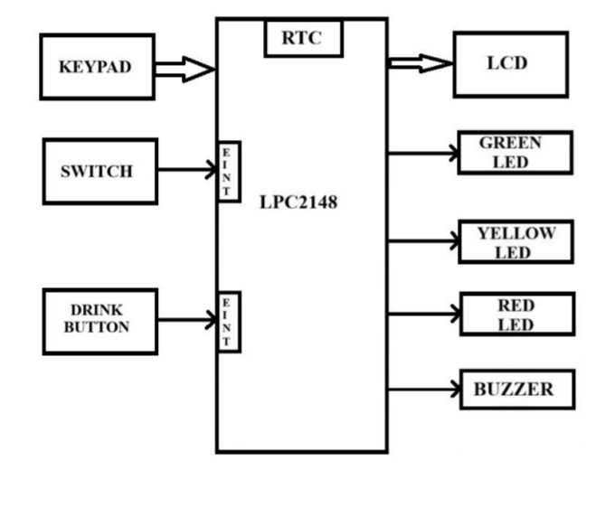
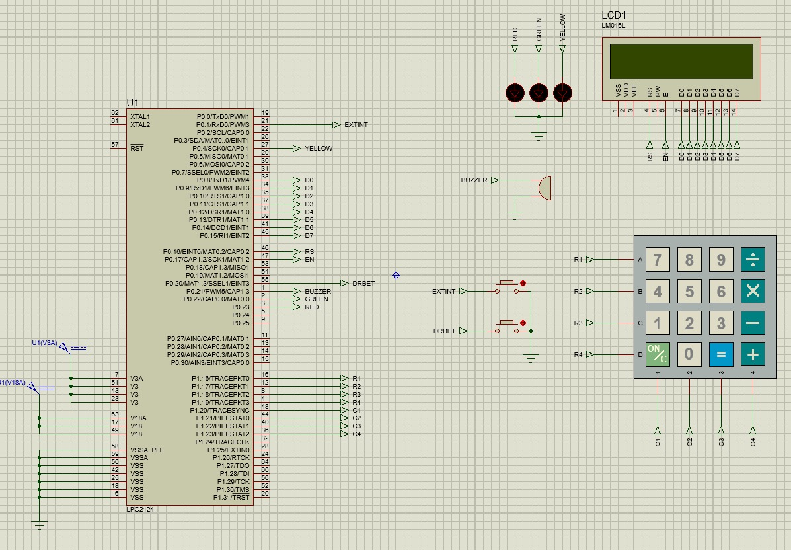
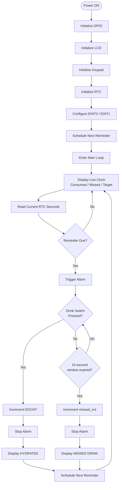
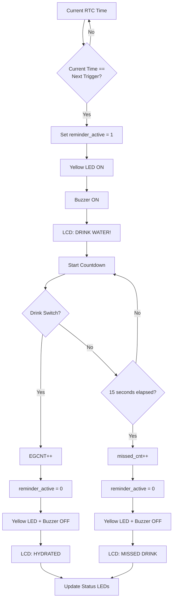
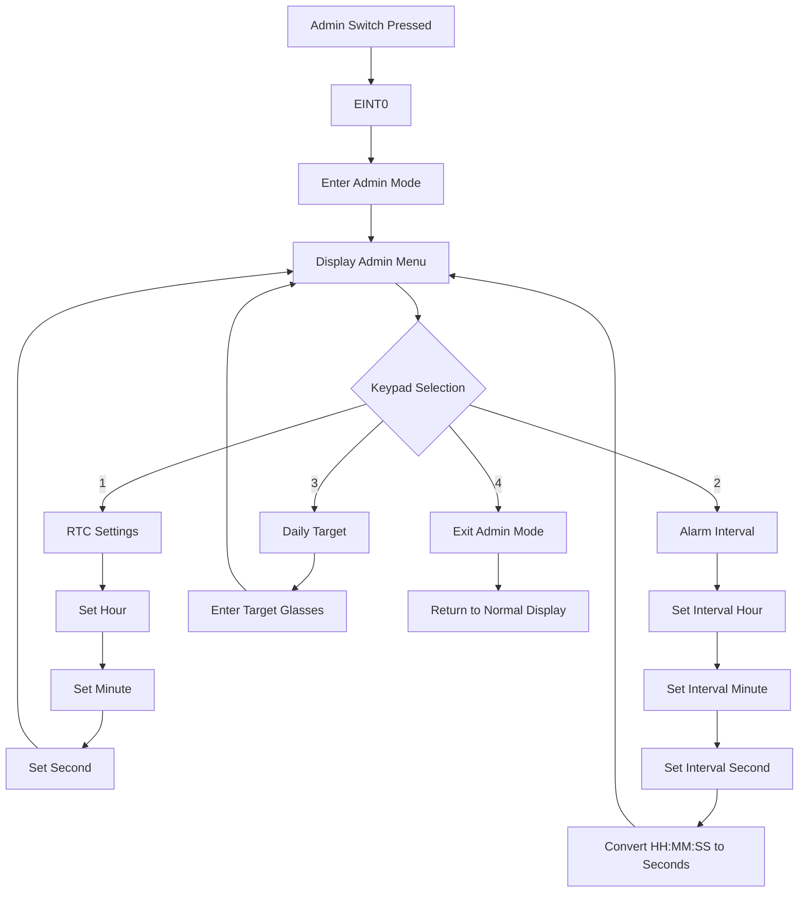
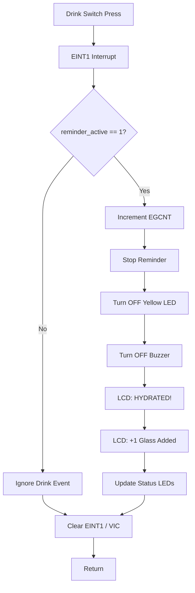
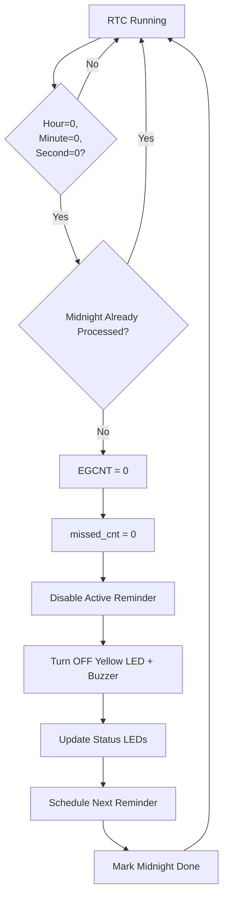
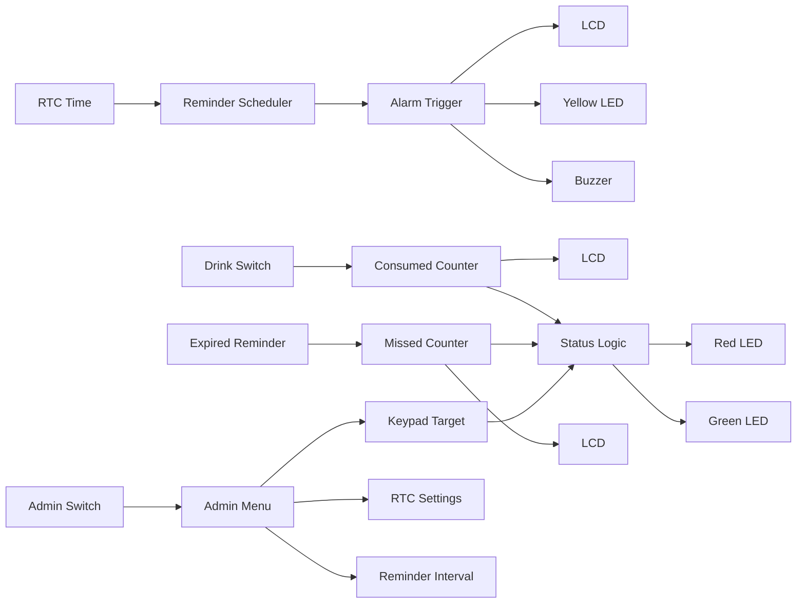
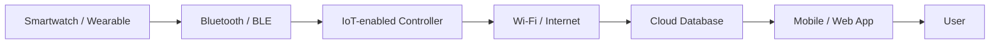
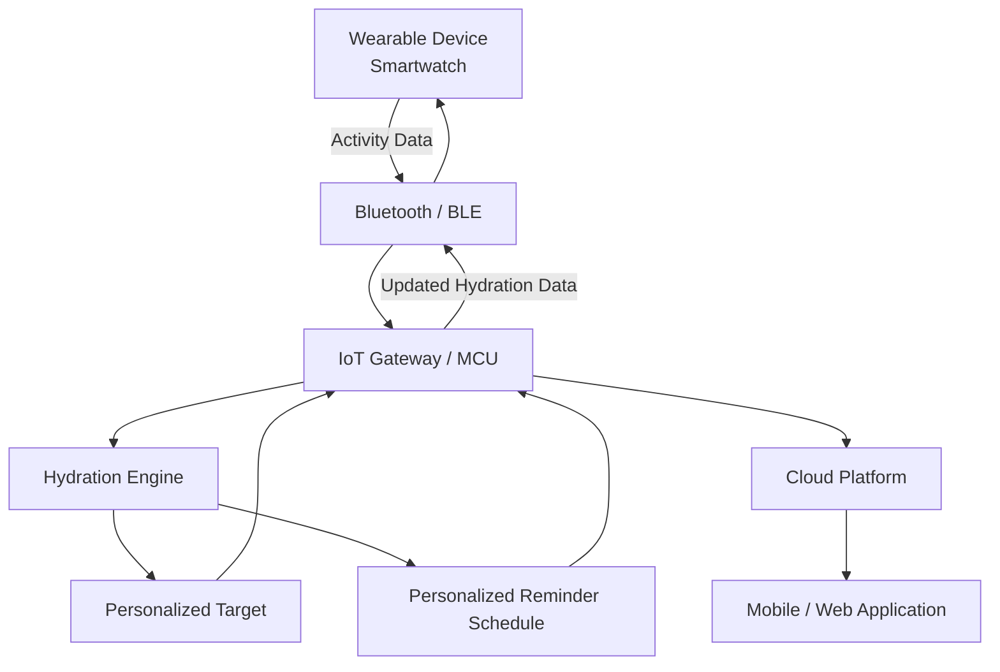

# 💧 AquaGuardian — Smart Water Drinking Reminder System

> **An Embedded C + LPC2148 based hydration monitoring and reminder system using RTC scheduling, LCD, keypad, external interrupts, LEDs, and buzzer alerts.**


---

## 📌 Table of Contents

- [Overview](#-overview)
- [Project Aim](#-project-aim)
- [Objectives](#-objectives)
- [Key Features](#-key-features)
- [System Architecture](#-system-architecture)
- [Hardware Requirements](#-hardware-requirements)
- [Software Requirements](#-software-requirements)
- [Hardware Connections](#-hardware-connections)
- [Circuit / Wiring Diagram](#-circuit--wiring-diagram)
- [Working Principle](#-working-principle)
- [Main Program Flowchart](#-main-program-flowchart)
- [Reminder Flowchart](#-reminder-flowchart)
- [Admin Mode Flowchart](#-admin-mode-flowchart)
- [Drink Button Interrupt Flow](#-drink-button-interrupt-flow)
- [Daily Reset Flow](#-daily-reset-flow)
- [LED Status Logic](#-led-status-logic)
- [LCD Interface](#-lcd-interface)
- [Keypad Interface](#-keypad-interface)
- [RTC and Reminder Scheduling](#-rtc-and-reminder-scheduling)
- [External Interrupts](#-external-interrupts)
- [Project File Structure](#-project-file-structure)
- [Module Description](#-module-description)
- [Important Parameters](#-important-parameters)
- [Data Flow](#-data-flow)
- [Operating Sequence](#-operating-sequence)
- [Test Cases](#-test-cases)
- [Advantages](#-advantages)
- [Limitations](#-limitations)
- [Future Scope](#-future-scope)
- [IoT / Smartwatch Expansion](#-iot--smartwatch-expansion)
- [Concepts to Learn](#-concepts-to-learn)
- [How to Build and Flash](#-how-to-build-and-flash)
- [Project Demonstration](#-project-demonstration)
- [Conclusion](#-conclusion)
- [Author](#-author)

---

## 🌊 Overview

**AquaGuardian** is an embedded hydration-monitoring and water-drinking reminder system developed around the **LPC2148 ARM7 microcontroller**.

The system uses a **Real-Time Clock (RTC)** to maintain time and schedule drinking reminders. A **16×2 LCD** provides the user interface, while a **4×4 matrix keypad** allows configuration of parameters such as RTC values, reminder interval, and daily water target.

A dedicated **Drink switch** allows the user to acknowledge a reminder and record one glass of water. An **Admin switch**, implemented using an external interrupt, opens the configuration menu.

The system provides three visual status indications:

- 🟡 **Yellow LED** — active drinking reminder
- 🟢 **Green LED** — daily target achieved
- 🔴 **Red LED** — hydration is behind the tracked schedule

A **buzzer** provides an audible reminder.

The current implementation also includes a short reminder-response window with a countdown. If the user responds during the active reminder, one glass is recorded; otherwise, the missed-drink counter is incremented.

---

## 🎯 Project Aim

The aim of AquaGuardian is to develop a compact embedded system that:

1. Maintains real-time clock information.
2. Automatically schedules water-drinking reminders.
3. Records water consumption through a physical switch.
4. Maintains a configurable daily water-intake target.
5. Displays hydration information on an LCD.
6. Provides LED and buzzer indications.
7. Allows configuration through an interrupt-driven admin menu.
8. Resets daily hydration counters automatically at midnight.

The project documentation also describes the system as an embedded healthcare application intended to encourage regular hydration. 

---

## 🎯 Objectives

- Display the current RTC time on the LCD.
- Maintain a configurable reminder interval.
- Record each acknowledged drink as one glass.
- Maintain a configurable daily target.
- Track consumed and missed drinks.
- Provide visual and audible alerts.
- Allow RTC configuration through the keypad.
- Allow reminder-interval configuration.
- Allow the daily target to be changed.
- Use external interrupts for Admin and Drink actions.
- Automatically reset daily counters at midnight.
- Keep the system modular using separate C source/header files.

---

# ⭐ Key Features

| Feature | Description |
|---|---|
| ⏱️ RTC | Maintains current time/date |
| ⏰ Reminder Scheduler | Generates the next drinking reminder |
| 💧 Drink Counter | Increments when the Drink switch is pressed during an active reminder |
| 🎯 Daily Target | User-configurable target number of glasses |
| 🚨 Reminder Alarm | LCD + Yellow LED + buzzer |
| ⌛ Countdown | Displays the remaining response time |
| ❌ Missed Counter | Counts reminders that were not acknowledged |
| 🟢 Goal Indicator | Green LED when target is reached |
| 🔴 Warning Indicator | Red LED when missed drinks exceed consumed drinks |
| 🟡 Reminder Indicator | Yellow LED while an alarm is active |
| 🔢 Keypad | Used for numeric configuration |
| ⚡ External Interrupts | Separate Admin and Drink switch handling |
| 🌙 Midnight Reset | Clears daily counters at the start of a new day |
| 🛠️ Admin Menu | RTC, Alarm Interval and Target configuration |

---

# 🧩 System Architecture

The supplied block diagram shows the overall system architecture: the **LPC2148** is the central controller, with the RTC, keypad, switches, LCD, LEDs and buzzer connected around it.



### High-Level Architecture

```text
                  +----------------------+
                  |      LPC2148 MCU     |
                  |                      |
                  |  RTC Scheduling      |
                  |  Hydration Counter   |
                  |  Reminder Logic      |
                  |  Admin Menu          |
                  +----------+-----------+
                             |
           +-----------------+------------------+
           |          |          |       |     |
           v          v          v       v     v
         LCD       Keypad      Admin   Drink  Indicators
       16x2 LCD     4x4       Switch   Switch  LEDs+Buzzer
                              EINT0    EINT1
```


# 🔧 Hardware Requirements

| Component | Purpose |
|---|---|
| **LPC2148** | Main ARM7 microcontroller |
| **16×2 LCD** | Displays time, hydration status, menus and alerts |
| **4×4 Matrix Keypad** | User configuration/input |
| **RTC peripheral of LPC2148** | Time/date keeping and reminder scheduling |
| **Admin Switch** | Enters Admin Mode through EINT0 |
| **Drink Switch** | Records a drink through EINT1 |
| **Red LED** | Indicates hydration is behind schedule |
| **Yellow LED** | Indicates active reminder |
| **Green LED** | Indicates target achieved |
| **Buzzer** | Audible reminder |
| **USB-UART / DB-9** | Programming/debugging interface as used in the project setup |
| Power Supply | Provides regulated power to the embedded system |

The project document specifies LPC2148, 16×2 LCD, 4×4 keypad, LEDs, switches, buzzer and USB-UART/DB-9 as the major hardware requirements.

---

# 💻 Software Requirements

- Embedded C
- ARM7/LPC2148 development environment
- LPC2148 device header/library support
- Flash Magic for programming
- ARM7-compatible compiler/toolchain
- Serial/programming interface as applicable to the hardware setup

---

# 🔌 Hardware Connections

The current source code uses the following important GPIO assignments.

## LCD

| LCD Signal | LPC2148 Pin/Port |
|---|---|
| LCD Data D0–D7 | P0.8–P0.15 |
| RS | P0.16 |
| EN | P0.17 |
| RW | P0.18 |

The code explicitly configures the LCD data bus at bit position 8 and uses P0.16/P0.17/P0.18 for RS/EN/RW.

## Keypad

| Keypad Signal | LPC2148 |
|---|---|
| Row 0 | P1.16 |
| Row 1 | P1.17 |
| Row 2 | P1.18 |
| Row 3 | P1.19 |
| Column 0 | P1.20 |
| Column 1 | P1.21 |
| Column 2 | P1.22 |
| Column 3 | P1.23 |

## LEDs and Buzzer

| Device | GPIO |
|---|---|
| Red LED | P0.20 |
| Yellow LED | P0.21 |
| Green LED | P0.22 |
| Buzzer | P0.23 |

The project intentionally places the LEDs and buzzer above the LCD GPIO range to avoid overlapping the LCD interface.

## External Interrupts

| Function | Signal | MCU Pin | VIC Channel |
|---|---|---|---|
| Admin | EINT0 | P0.1 | 14 |
| Drink | EINT1 | P0.3 | 15 |

These mappings are implemented in `maincode.c`.

---

# 🔌 Circuit / Wiring Diagram

The supplied circuit diagram shows the LPC2148 connections used in the project, including the **16×2 LCD, 4×4 keypad, Admin/Drink external-interrupt switches, Red/Yellow/Green LEDs, and buzzer**.



The important connections represented in the circuit are:

- **LCD:** D0–D7 on P0.8–P0.15, RS on P0.16, EN on P0.17 and RW on P0.18.
- **Keypad:** Rows on P1.16–P1.19 and columns on P1.20–P1.23.
- **LEDs and buzzer:** Red LED on P0.20, Yellow LED on P0.21, Green LED on P0.22 and buzzer on P0.23.
- **External interrupts:** Admin switch through EINT0/P0.1 and Drink switch through EINT1/P0.3.
- **RTC:** Uses the RTC peripheral integrated in the LPC2148.


# ⚙️ Working Principle

The controller performs the following sequence:

1. Initialize GPIO, LCD, keypad and RTC.
2. Configure EINT0 and EINT1.
3. Schedule the first reminder.
4. Continuously display the live RTC time and hydration counters.
5. Compare the current RTC time with the next reminder time.
6. When the scheduled time is reached:
   - activate reminder mode,
   - switch on Yellow LED and buzzer,
   - display `DRINK WATER!`,
   - start the response countdown.
7. If the Drink switch is pressed:
   - increment consumed-glass counter,
   - stop the alarm,
   - display hydration confirmation,
   - update status indicators.
8. If the response window expires:
   - increment the missed-drink counter,
   - turn off the alarm,
   - display `MISSED DRINK!`.
9. The next reminder is scheduled.
10. At midnight, daily counters are reset.

---

# 🔄 Main Program Flowchart



---

# 🚨 Reminder Flowchart



---

# 🔐 Admin Mode Flowchart

Admin mode is entered using the EINT0 switch.



### Admin Menu

```text
+----------------+
| 1.RTC  2.Alarm |
| 3.Target 4.Exit|
+----------------+
```

---

# 🥤 Drink Button Interrupt Flow

The Drink switch is connected to EINT1.



---

# 🌙 Daily Reset Flow

At midnight:



The configured target is retained while the daily consumed/missed counters are reset.

---

# 💡 LED Status Logic

The current firmware uses three status outputs.

| Condition | LED |
|---|---|
| Reminder active | 🟡 Yellow |
| Daily target achieved | 🟢 Green |
| Consumed count is below missed count | 🔴 Red |
| Otherwise | Red/Green turned off according to current status logic |

The corresponding logic is implemented in `Update_Status_LEDs()`.

### Conceptual status model

```text
                    +-------------------+
                    | Hydration Status  |
                    +---------+---------+
                              |
             +----------------+----------------+
             |                                 |
       EGCNT >= FGCNT                    EGCNT < missed_cnt
             |                                 |
             v                                 v
       GREEN LED ON                      RED LED ON

                 Reminder Active
                       |
                       v
                 YELLOW LED ON
```

---

# 📺 LCD Interface

The LCD is used for multiple operating states.

### Normal Display

```text
+----------------+
| HH:MM:SS   DAY |
| [Consumed] ... |
+----------------+
```

The firmware displays the RTC time and day along with hydration counters.

### Reminder Display

```text
+----------------+
| DRINK WATER!   |
| IN:   15       |
+----------------+
```

The countdown decreases during the reminder-response window.

### Successful Hydration

```text
+----------------+
|   HYDRATED!    |
| +1 Glass Added |
+----------------+
```

### Missed Reminder

```text
+----------------+
| MISSED DRINK!  |
|                |
+----------------+
```

### Invalid Input

```text
+----------------+
| INVALID INPUT! |
| Max Allowed:XX |
+----------------+
```

---

# 🔢 Keypad Interface

The firmware uses a 4×4 matrix keypad.

Current lookup table:

```text
+---+---+---+---+
| 1 | 2 | 3 | A |
+---+---+---+---+
| 4 | 5 | 6 | B |
+---+---+---+---+
| 7 | 8 | 9 | C |
+---+---+---+---+
| = | 0 | = | + |
+---+---+---+---+
```

The interactive numeric input routine supports:

- Numeric entry
- `C` for character erase/backspace
- `A` for input confirmation

Example:

```text
Set Target:

User enters:
0 -> 8 -> A

Result:
FGCNT = 8
```

---

# ⏱️ RTC and Reminder Scheduling

The reminder scheduler converts the current RTC time into seconds:

```c
CurrentSeconds =
    (HOUR * 3600) +
    (MIN * 60) +
    SEC;
```

The next reminder is calculated as:

```c
next_trigger_sec =
    (current_sec + interval_sec) % SECONDS_PER_DAY;
```

This makes the scheduler capable of handling the day boundary.

### Example

Suppose:

```text
Current time = 10:59:55
Interval     = 00:00:15
```

Then:

```text
Current seconds = 39595
Next trigger    = 39610
Next time       = 11:00:10
```

The modulo operation also allows scheduling across midnight.

---

# ⚡ External Interrupts

The project uses two external interrupts.

## EINT0 — Admin

```text
P0.1
  |
  v
EINT0
  |
  v
eint0_isr()
  |
  v
interr0_disp()
  |
  v
Admin Menu
```

## EINT1 — Drink

```text
P0.3
  |
  v
EINT1
  |
  v
eint1_isr()
  |
  v
interr1_disp()
  |
  v
Record Drink
```

The VIC channels used are:

```text
EINT0 -> VIC Channel 14
EINT1 -> VIC Channel 15
```

---

# 📁 Project File Structure

```text
AquaGuardian/
│
├── README.md
│
├── maincode.c
├── functions.c
├── functions.h
├── rtc.c
├── lcd.c
├── KPM.c
├── types.h
│
├── docs/
│   ├── block-diagram.md
│   ├── flowcharts.md
│   └── circuit-diagram.md
│
└── images/
    ├── block-diagram.png
    ├── circuit-diagram.png
    ├── flowchart.png
    └── hardware.jpg
```

---

# 🧱 Module Description

| File | Responsibility |
|---|---|
| `maincode.c` | Main application, peripheral initialization, interrupt configuration and main loop |
| `functions.c` | Main application logic, display functions, alarm handling, admin functions and status LEDs |
| `functions.h` | GPIO definitions, LCD definitions, application constants, prototypes and register macros |
| `rtc.c` | RTC initialization, time/date setting and midnight reset |
| `lcd.c` | LCD low-level driver and numeric/string display functions |
| `KPM.c` | 4×4 matrix keypad scanning and numeric input |
| `types.h` | User-defined fixed-width-style type aliases |

---

# 🔧 Important Parameters

The current firmware defines:

```c
#define DEFAULT_INTERVAL_SEC 15
#define DEFAULT_TARGET_GLASSES 8
#define ALARM_WINDOW_SEC 15
#define SECONDS_PER_DAY 86400
```

### Meaning

| Parameter | Current Value | Meaning |
|---|---:|---|
| `DEFAULT_INTERVAL_SEC` | 15 s | Default reminder interval |
| `DEFAULT_TARGET_GLASSES` | 8 | Default daily target |
| `ALARM_WINDOW_SEC` | 15 s | Reminder response window |
| `SECONDS_PER_DAY` | 86400 | Seconds in one day |
| `KEYPAD_DEBOUNCE_MS` | 20 ms | Keypad debounce constant |

> **Note:** The project concept/documentation describes periodic or hourly hydration reminders, while the current firmware defaults to a **15-second interval**. The interval is configurable through the Admin → Alarm menu, so the demo value can be changed for actual deployment.

---

# 🔄 Data Flow



---

# ▶️ Operating Sequence

## 1. Startup

```text
Power ON
   ↓
GPIO Initialization
   ↓
LCD Initialization
   ↓
Keypad Initialization
   ↓
RTC Initialization
   ↓
External Interrupt Configuration
   ↓
Reminder Scheduling
```

## 2. Normal Monitoring

```text
RTC Running
   ↓
LCD Updates
   ↓
Hydration Counters Displayed
   ↓
RTC Compared With Next Trigger
```

## 3. Reminder

```text
Reminder Due
   ↓
Yellow LED + Buzzer
   ↓
DRINK WATER!
   ↓
Countdown
```

## 4. User Response

```text
Drink Switch
   ↓
Consumed Counter +1
   ↓
Alarm OFF
   ↓
HYDRATED!
   ↓
Next Reminder
```

## 5. No Response

```text
Countdown Ends
   ↓
Missed Counter +1
   ↓
Alarm OFF
   ↓
MISSED DRINK!
   ↓
Next Reminder
```

---

# 🧪 Test Cases

| Test | Input / Condition | Expected Result |
|---|---|---|
| TC01 | Power ON | LCD, keypad, GPIO and RTC initialize |
| TC02 | Normal operation | RTC time displayed |
| TC03 | Reminder time reached | Yellow LED and buzzer activate |
| TC04 | Reminder active + Drink switch | Consumed counter increments |
| TC05 | Reminder active + no switch | Missed counter increments after response window |
| TC06 | Consumed count reaches target | Green LED activates |
| TC07 | Missed count becomes greater than consumed count | Red LED indication |
| TC08 | Admin switch | Admin menu appears |
| TC09 | Admin → RTC | RTC time can be modified |
| TC10 | Admin → Alarm | Reminder interval can be configured |
| TC11 | Admin → Target | Daily target can be changed |
| TC12 | Invalid RTC hour | Invalid-input message |
| TC13 | Invalid RTC minute | Invalid-input message |
| TC14 | Invalid RTC second | Invalid-input message |
| TC15 | Invalid target | Invalid-input handling |
| TC16 | Midnight | Daily consumed/missed counters reset |
| TC17 | Reminder crossing midnight | Scheduler handles 24-hour rollover |

---

# 📈 Advantages

- Simple embedded hardware architecture.
- Low-cost implementation.
- Real-time reminder generation.
- User-configurable target.
- User-configurable reminder interval.
- Physical acknowledgement of water intake.
- LCD provides direct user feedback.
- LED indicators provide quick status information.
- Buzzer provides audible notification.
- Interrupt-driven Admin and Drink controls.
- Automatic daily reset.
- Modular C source structure.
- Suitable as a foundation for IoT-based hydration monitoring.

---

# ⚠️ Limitations

The present version is primarily a **standalone embedded system**.

Current limitations include:

- No wireless connectivity.
- No cloud database.
- No smartphone application.
- No smartwatch integration.
- Water intake is recorded manually using a physical switch.
- The system does not directly measure the volume of water consumed.
- Hydration targets are manually configured rather than physiologically personalized.
- The current reminder algorithm is RTC/time-interval based.
- User profiles are not implemented in the current firmware.

These limitations create opportunities for the next version.

---

# 🚀 Future Scope

The next-generation AquaGuardian can evolve from a standalone reminder device into a **personalized IoT-based hydration monitoring ecosystem**.

## 1. ⌚ Smartwatch Integration

The system can communicate with wearable devices such as smartwatches.

Possible data received from a wearable:

```text
Heart Rate
     +
Activity Level
     +
Calories Burnt
     +
Steps
     +
Workout Duration
     +
Environmental / Activity Context
     ↓
Personalized Hydration Engine
```

The hydration engine can use this information to dynamically adjust:

- Drinking reminder frequency
- Daily water target
- Reminder intensity
- Alarm timing
- Post-workout hydration reminders

---

## 2. 🔥 Calorie-Based Hydration Adjustment

Instead of using one fixed target for every user, the future system can dynamically adapt the hydration plan.

Example conceptual flow:

```text
Calories Burnt
      ↓
Activity Level
      ↓
Hydration Requirement Estimation
      ↓
Update Daily Target
      ↓
Recalculate Reminder Interval
      ↓
Notify User
```

For example, after increased physical activity, the system could generate a more frequent hydration schedule based on the application's configured hydration model.

> Any real-world health recommendation should use a validated medical/physiological model rather than treating calorie expenditure alone as a complete measure of water requirement.

---

## 3. 👤 Multiple User Profiles

A future version could support different users.

```text
                 +----------------+
                 | User Selection |
                 +--------+-------+
                          |
          +---------------+---------------+
          |               |               |
          v               v               v
       User A          User B          User C
          |               |               |
      Profile A       Profile B       Profile C
          |               |               |
      Target A        Target B        Target C
      Schedule A      Schedule B      Schedule C
```

Each profile could store:

- Personal target
- Reminder interval
- Activity level
- Historical intake
- Exercise information
- Wearable data
- Daily progress

---

## 4. ☁️ IoT Cloud Connectivity

A Wi-Fi/Bluetooth-enabled controller could transmit hydration information to a cloud platform.



Potentially stored information:

```text
Timestamp
Water Intake
Reminder Events
Missed Reminders
Activity
Calories Burnt
Daily Goal
Goal Completion
```

---

## 5. 📲 Smartphone Application

A mobile application could provide:

- Live hydration status
- Daily/weekly/monthly history
- Reminder configuration
- User profiles
- Activity synchronization
- Hydration charts
- Missed-reminder statistics
- Device configuration

---

## 6. ⌚ Two-Way Smartwatch Updates

The future system should not only **read data from the smartwatch**, but also **send updated hydration information back to it**.

```text
SMARTWATCH
    │
    │ Activity / Calories / Heart Rate
    ▼
AquaGuardian
    │
    │ Personalized calculation
    ▼
Hydration Engine
    │
    ├── New Daily Target
    ├── New Reminder Interval
    └── Reminder Status
    │
    ▼
SMARTWATCH
    │
    ├── "Drink Water"
    ├── Daily Progress
    ├── Remaining Target
    └── Reminder Notification
```

This creates a **closed-loop wearable hydration system**.

---

# 🌐 IoT / Smartwatch Expansion

A possible future architecture:



### Example Future Data Packet

```text
USER_ID
TIMESTAMP
HEART_RATE
STEPS
CALORIES_BURNT
ACTIVITY_LEVEL
WATER_INTAKE
MISSED_REMINDERS
DAILY_TARGET
NEXT_REMINDER
```

---

# 🧠 Concepts to Learn for This Project

To understand and explain AquaGuardian confidently in an interview or project review, focus on these concepts.

## Embedded C

- Data types
- Structures
- Arrays
- Pointers
- Functions
- Header files
- `extern`
- `static`
- `volatile`
- Bit manipulation
- Macros
- Modular programming

## LPC2148 / ARM7

- ARM7TDMI architecture
- GPIO
- `IODIR`
- `IOSET`
- `IOCLR`
- `IOPIN`
- PINSEL registers
- VIC
- IRQ handling
- External interrupts
- EINT0/EINT1
- Timer/RTC peripherals

## RTC

- RTC registers
- Clock tick generation
- Prescaler
- Time/date registers
- Seconds conversion
- 24-hour rollover
- Midnight detection
- Scheduling algorithms

## LCD

- HD44780-compatible LCD
- 8-bit mode
- Command/data registers
- RS
- RW
- EN
- DDRAM
- CGRAM
- LCD initialization sequence

## Keypad

- Matrix keypad scanning
- Row scanning
- Column scanning
- Debouncing
- Key lookup table
- Numeric input parsing

## Interrupts

- Interrupt vector
- VIC channel
- ISR
- IRQ mode
- External interrupt configuration
- Edge-triggered interrupt
- Interrupt flag clearing
- Interrupt-safe shared variables

## Embedded System Design

- State machines
- Event-driven programming
- Hardware/software interfacing
- Real-time scheduling
- Modular firmware
- Test-case design
- Fault handling
- Human-machine interface

## Future IoT Version

- UART
- SPI / I²C
- Bluetooth Low Energy
- Wi-Fi
- MQTT
- REST APIs
- Cloud databases
- Mobile application development
- Wearable APIs
- Sensor fusion
- Secure device communication

---

# 🛠️ How to Build and Flash

A typical workflow is:

```text
Edit Source Code
      ↓
Compile
      ↓
Resolve Warnings / Errors
      ↓
Generate HEX/BIN
      ↓
Connect LPC2148 Board
      ↓
Use Flash Magic / Programmer
      ↓
Program MCU
      ↓
Power ON
      ↓
Test LCD / Keypad / RTC / Switches
```

---

# 📸 Project Demonstration

Project photographs can be placed under `images/`:

```text
images/
├── hardware-overview.jpg
├── lpc2148-board.jpg
├── lcd-normal-mode.jpg
├── drink-reminder.jpg
├── admin-mode.jpg
├── keypad-input.jpg
└── final-prototype.jpg
```

Demonstration sequence:

### Demo 1 — Normal Mode

Show:

```text
RTC Time
+
Day
+
Consumed Count
+
Missed Count
+
Target
```

### Demo 2 — Reminder

Show:

```text
DRINK WATER!
IN: 15
```

along with Yellow LED and buzzer.

### Demo 3 — Successful Drink

Press the Drink switch and show:

```text
HYDRATED!
+1 Glass Added
```

### Demo 4 — Missed Reminder

Do not press the Drink switch and show:

```text
MISSED DRINK!
```

### Demo 5 — Admin Mode

Demonstrate:

```text
1. RTC
2. Alarm
3. Target
4. Exit
```

### Demo 6 — Target Achievement

Configure a small target for demonstration and show the Green LED when it is reached.

---

# 📊 Project Highlights

```text
                    AQUAGUARDIAN
                         |
        +----------------+----------------+
        |                |                |
       RTC            HYDRATION         USER I/O
        |             TRACKING            |
        |                |                |
   Scheduling       Consumed Count      Keypad
   Timekeeping      Missed Count        Switches
   Midnight Reset   Daily Target
        |                |
        +----------------+----------------+
                         |
                    ALERT SYSTEM
                         |
              +----------+----------+
              |          |          |
             LCD        LED       BUZZER
```

---

# 🔮 Long-Term Vision

The project can evolve through the following stages:

```text
Stage 1
Standalone Embedded Reminder
        ↓
Stage 2
Configurable Hydration Tracker
        ↓
Stage 3
Bluetooth / Wi-Fi Connectivity
        ↓
Stage 4
Smartphone Application
        ↓
Stage 5
Smartwatch Integration
        ↓
Stage 6
Personalized Activity-Aware Hydration
        ↓
Stage 7
Cloud-Based Multi-User Hydration Platform
```

The long-term objective is to transform AquaGuardian from a simple timer-based reminder into a **connected, personalized hydration-management platform** that combines embedded hardware, wearable data, IoT connectivity and user-specific scheduling.

---

# 📜 Conclusion

**AquaGuardian** demonstrates how an ARM7-based embedded system can combine:

- Real-Time Clock operation
- Interrupt handling
- GPIO control
- LCD interfacing
- Matrix keypad interfacing
- Audible alerts
- LED status indication
- Event-driven user interaction
- Time-based scheduling
- Daily data management

into one integrated application.

The current version provides a strong embedded-systems foundation, while the proposed smartwatch and IoT architecture provides a path toward personalized, connected hydration monitoring.

---

# 👨‍💻 Author

**AquaGuardian — Smart Water Drinking Reminder System**

Developed as an Embedded C / ARM7 microcontroller project using the LPC2148.

---

---

## 📌 Project Note

The source code currently implements a configurable reminder scheduler with a **15-second default demonstration interval** and a **15-second reminder response window**. For a real-world deployment, the reminder interval and hydration calculation should be configured using an appropriate, validated health/hydration model rather than relying on a single fixed value.
